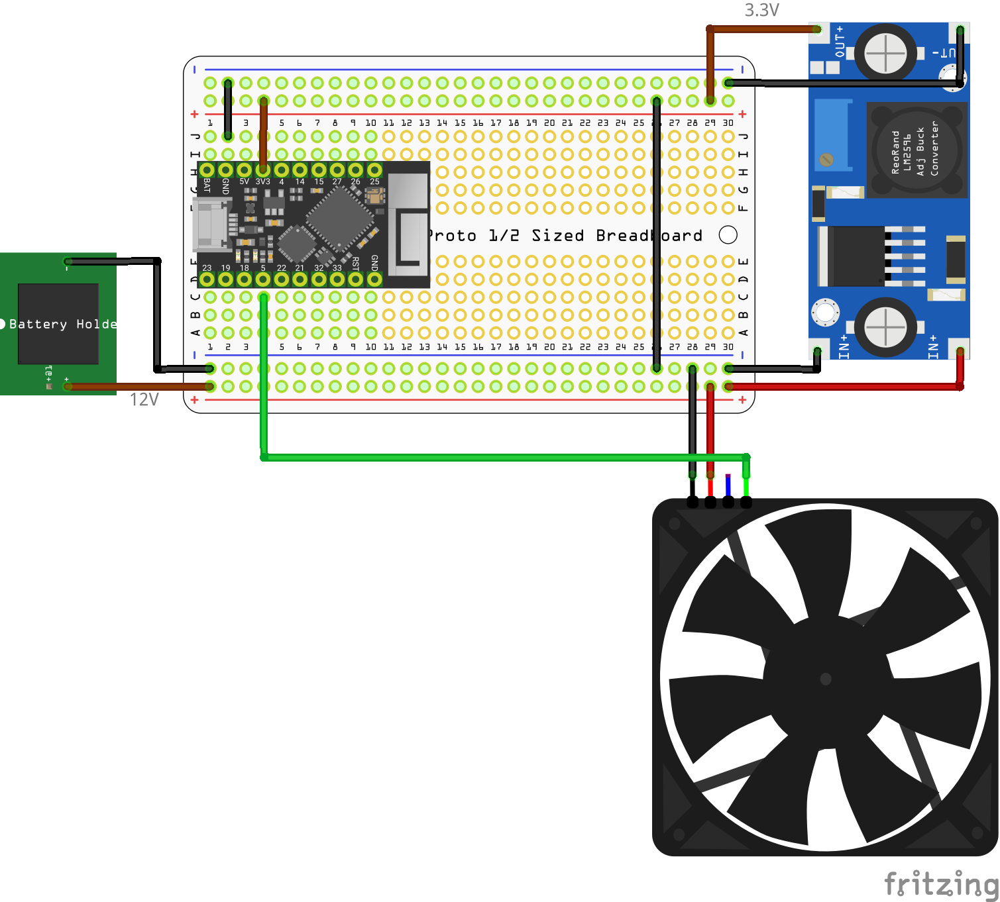

# Bluetooth Dash and Wind Sumlator for SimHub

This projects is aiming to implement a small dash for 128x64 OLED screens and wind simulator or fan controller over Bluetooth to work with sim racing games.

It's rather primitive but sharing because of few requests.

## BOM

* Any ESP32 chip
  * if you want dash get one with 128x64 OLED screen, they are planty available on the market 
* [Noctual NF-A14 Industrial 3000](https://noctua.at/en/nf-a14-industrialppc-3000-pwm) fan, but any PWM fan would work
* A buck converter to convert 12 volts to 3.3 volts.
  * I'll suggest getting this tiny one [AP3429A](https://www.adafruit.com/product/4711) from Adafruit. It doesn't need to be powerful, it will only power your ESP32 board.
* 12 volts power source. You can get 12V Li-Ion battery pack or 12V DC power supply to power your fan.

## Wiring

Attach your fan's PWM pin (green one) to the pin `FAN_GPIO` (5 by default), attach power and connect grounds.

## Compilation

* Install [Platform IO](https://platformio.org/install), configure your pins and settings in [src/config.h](src/config.h) and build and upload to your ESP32.

## Usage

* After successful build go ahead to your OS bluetooth settings and pair with the new device. It should be called *SimHub Dash* by default.
* After that open SimHub and navigate to Settings -> Plugins and enable "Custom Serial Device". Follow [the official wiki](https://github.com/SHWotever/SimHub/wiki/Custom-serial-devices) if you need help.
* Then go to "CUSTOM SERIAL DEVICE" menu on the left and click on "Add new custom device". Click on "Import settings" and import the [assets/simhub.shsds] file (click on "View Raw" and download the file in Github).
* Then you have to select the correct COM port for your Bluetooth device. You can use Window's Device Manager to find it out. Disconnect your SimHub Dash device and the reconnect and look which COM ports appear in the list of "Serial devices".
* After setting up the serial device navigate to "Shakeit" section and enable "Speed" property. Click on "Test" to see if your fan is spinning.
